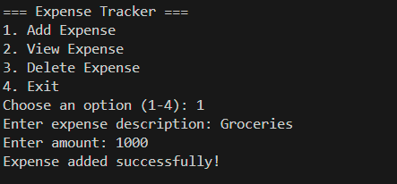
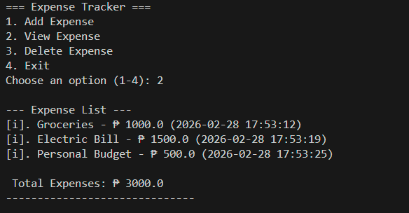

# Expense Tracker 

A Python program that allows users to record, view and manage daily expenses. All expenses are stored in JSON file ('expenses.json) for persistent data storage between sessions. 

## Features

- Add new expenses with description and amount 
- Automatic timestamp for each expense 
- View all recorded expenses 
- Automatic total expense calculation
- Delete specific expenses 
- Persistent storage using JSON 
- Input validation for numeric amounts 

# How to use 

1. Clone or download the repository. 
2. Make sure Python 3.x is installed.
3. Run the program:
    python tracker.py
4. Choose an option from the menu:

1 ⟶ Add Expense
2 ⟶ View Expense
3 ⟶ Delete Expense
4 ⟶ Exit

5. Expenses are automatically saved when you exit the program.

6. The program will create expenses.json of it does not exist.

## Example

1.

2.

## Requirments

Python 3.x
No external libraries required(uses only standard Python Library)

## File Structure 

tracker.py
expenses.json (auto-created)
README.md

## Author 

- John Melo Gonato
- https://github.com/Melo-dev24
